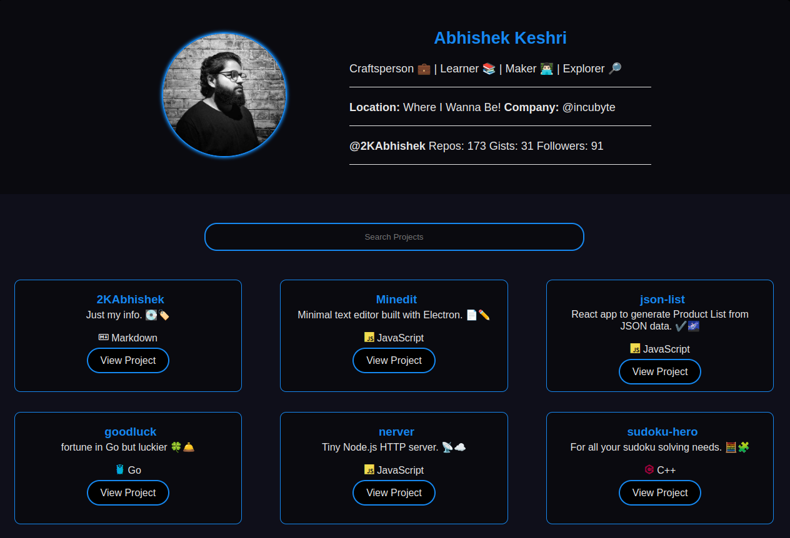

<div align = "center">

<h1><a href="https://2kabhishek.github.io/tiny-web">tiny-web</a></h1>

<a href="https://github.com/2KAbhishek/tiny-web/blob/main/LICENSE">
 </a>

<a href="https://github.com/2KAbhishek/tiny-web/graphs/contributors">
 </a>

<a href="https://github.com/2KAbhishek/tiny-web/stargazers">
</a>

<a href="https://github.com/2KAbhishek/tiny-web/network/members">
 </a>

<a href="https://github.com/2KAbhishek/tiny-web/watchers">
 </a>

<a href="https://github.com/2KAbhishek/tiny-web/pulse">
 </a>

<h3>Short sweet headline with 🎇🎉</h3>

<figure>
  
  <br/>
  <figcaption>tiny-web screenshot</figcaption>
</figure>

</div>

## What is this

tiny-web is a web app that allows `<insert_target_audience>` to `<action/task_it_does>`.

Tired of the hundreds of tools for building a website?

Want to build good ol web pages with `HTML` `CSS` & `JavaScript`?

You can of course do that, tiny-web just makes it quicker, let your digital paintbrush loose and make something tiny.

## Inspiration

tiny-web was inspired by `<reason/idea>`.

## Prerequisites

Before you begin, ensure you have met the following requirements:

- You have installed the latest version of `<coding_language/dependency/requirement_1>`

## Getting tiny-web

To get tiny-web, follow these steps:

```bash
git clone https://github.com/2kabhishek/tiny-web
cd tiny-web
```

## Viewing tiny-web

Open `index.html` in your favorite browser or visit [2kabhishek.github.io/tiny-web](https://2kabhishek.github.io/tiny-web).

## How it was built

tiny-web was built using `HTML` `CSS` & `JavaScript`.

## Challenges faced

While building tiny-web the main challenges were `<issue/difficulty>`

## What I learned

While building tiny-web I `<learned/accomplished>` about `<learning/accomplishment>`

## What's next

Planning to add `<feature/module>`.

### To-Do

- [x] Setup repo
- [ ] Think real hard
- [ ] Start typing
- [ ] Finish it

Hit the ⭐ button if you found this useful.

## More Info

<div align="center">

<a href="https://github.com/2KAbhishek/tiny-web">Source</a> | <a href="https://2kabhishek.github.io/tiny-web">Website</a>

</div>
